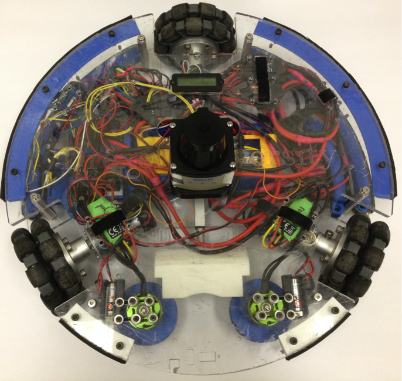

# THOR VICON

This repository contains code for using the THOR platform with a VICON system (tested on VICON Blade). THOR is a three omni-wheeled platform with integrated sensors including encoders, a compass, an accelerometer, and a SICK TiM-561 LIDAR mount. This platform provides data from these sensors to a ROS network hosted on a CPU on the platform in order to record this data in a time synchronized fashion and as well record data provided by a VICON system of the platform location and obstacles in the platforms local environment in order to provide ground truth data. This data then forms a dataset that can be used to test autonomy algorithms like Kalman and Particle filters as well as create sensor error models.

	
	
THOR Platform with LIDAR

## Table of Contents

-- TODO --

## Revisions List
Full Name | Email | Date | Revision | Description
--- | --- | --- | --- | ---
Frederick Wachter | [wachterfreddy@gmail.com](mailto:wachterfreddy@gmail.com) | 2018-04-16 | 0.0.0 | Initial document

-- TODO --

