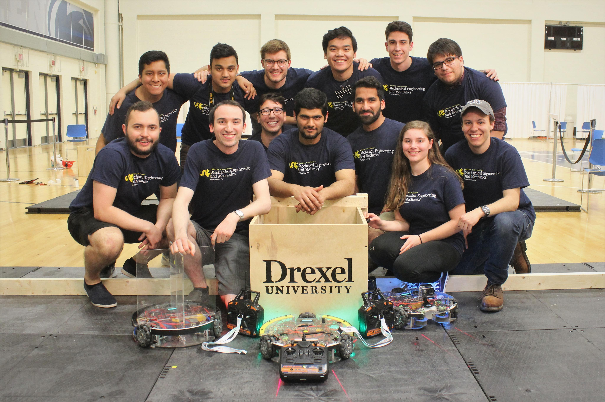

# Drexel ASME SDC Team 2018
Code repository for the Drexel ASME SDC team that competed in the Student Design Competition (SDC) hosted by ASME National at the 2018 ASME E-Fest East that occurred at Penn State on April 14th, 2018. The team placed 3rd out of the 54 teams that signed up for the competition. Some links and videos are below

[Competition Overview](https://goo.gl/zR7Z62)  
[Video from Competition](https://goo.gl/o6p2c8)

	
	
Drexel ASME 2018 SDC Team at Penn State

	
	
Robot Design Render

Workshop slides that were used to teach the team about the robot design process can be found below.

[Programming Workshop I](https://goo.gl/JvgcAz)  
[Robot Modeling Workshop I](https://goo.gl/meSPPA) (Not finished)

